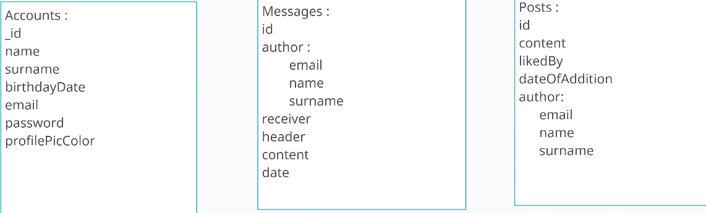
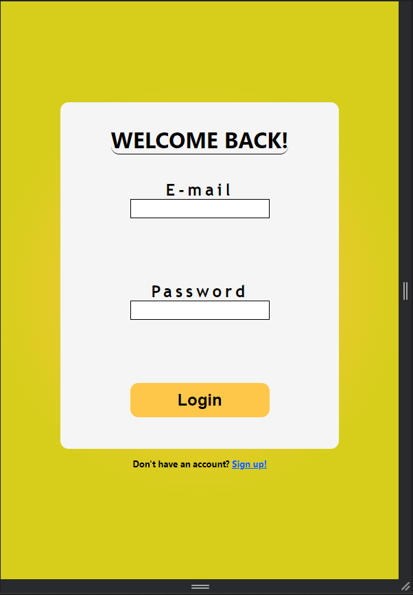
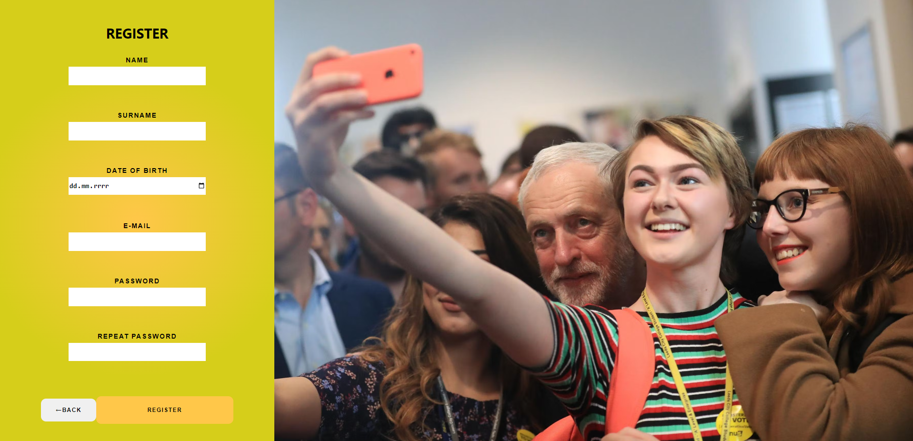
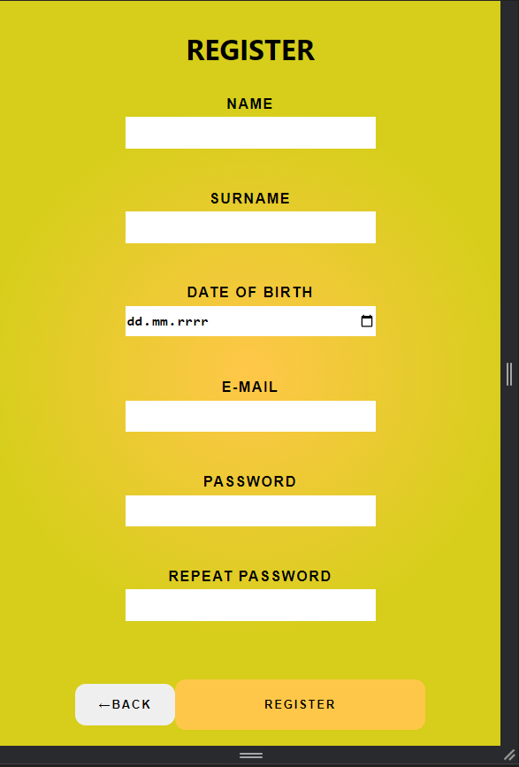
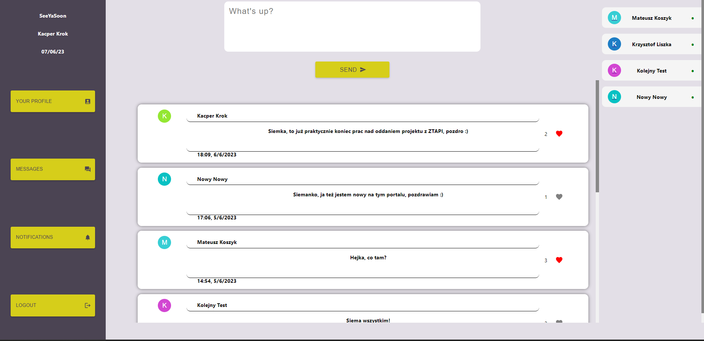
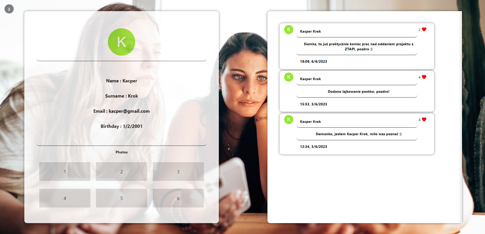
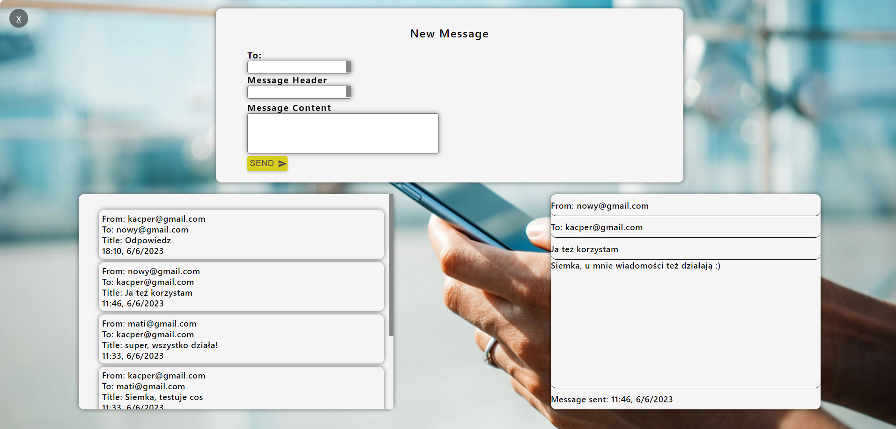
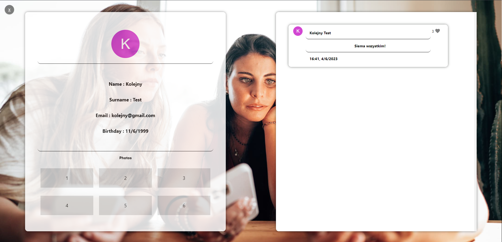

# PROJEKT ZTPAI

## SOCIAL-NETWORKING-SITE TO PROJEKT PORTALU SPOŁECZNOŚCIOWEGO. 
## DO JEGO PRZYGOTOOWANIA UŻYŁEM NASTĘPUJĄCYCH TECHNOLOGII :
- MONGODB
- EXPRESS
- REACT
- NODE.JS

## DIAGRAM ERD

## ZRZUTY EKRANU Z APLIKACJI

